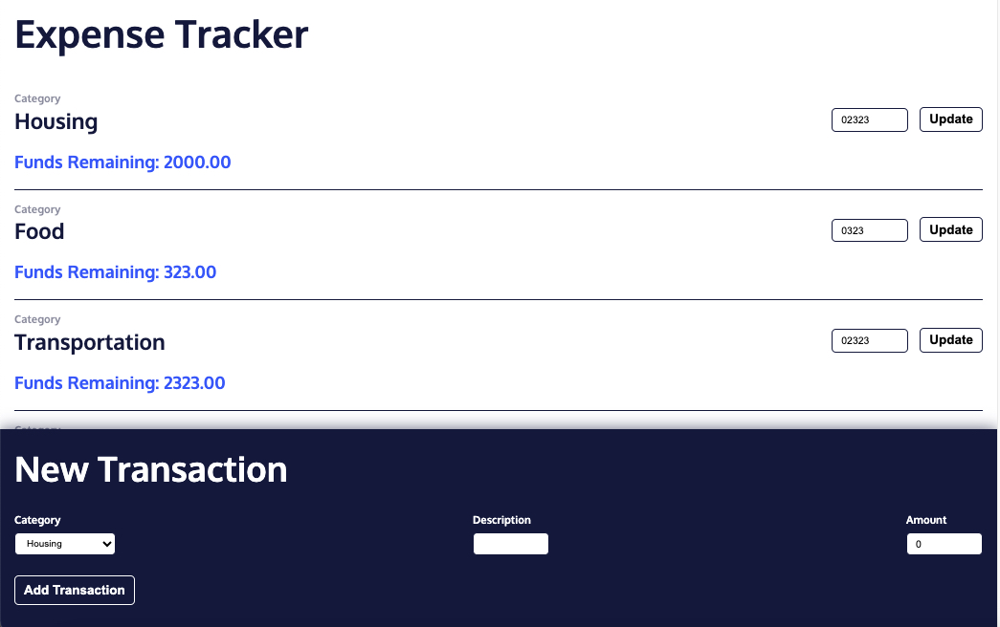

# Expense Tracker (Redux)

## Table of contents

- [Overview](#overview)
  - [The challenge](#the-challenge)
  - [Screenshot](#screenshot)
  - [Links](#links)
- [My process](#my-process)
  - [Built with](#built-with)
  - [What I learned](#what-i-learned)
  - [Continued development](#continued-development)
- [Author](#author)

## Overview

### The challenge

Users should be able to:

- View the optimal layout for the app depending on their device's screen size.
- Add budget amount to category.
- Add transaction amount to category.

### Screenshot

### Links

- Live Site URL: [View](https://expensetrackerredux.netlify.app/)

## My process

- In this project, I refactored an existing Redux application using Redux Toolkit’s `createSlice()` method, which simplified managing actions and reducers.
- First, I created a slice for the `budgets` state using `createSlice()`, which automatically generated action creators and reducers.
- I defined the slice with a `name`, an `initialState`, and a `reducers` object that contained the necessary logic, like the `editBudget` case.
- Once that slice was set up, I deleted the manually written action creators and reducers for budgets.
- Next, I applied the same process to the `transactions` slice.
- I defined actions like `addTransaction` and `deleteTransaction` within the `reducers` property of `createSlice()`.
- These reducers handled adding or deleting transactions from the state.
- After that, I cleaned up the code by removing the manually created transaction actions and reducers, and exported the auto-generated ones instead.
- This refactoring reduced boilerplate code and made the application more efficient and easier to maintain, while still allowing it to track budgets and transactions effectively.

### Built with

- Semantic HTML5 markup
- CSS custom properties
- Mobile-Responsive Design
- JavaScript - Scripting language
- [React](https://reactjs.org/) - JS library
- [Redux](https://redux.js.org/) - JS library
- [Redux Toolkit](https://redux-toolkit.js.org/) - JS library
- [React Redux](https://react-redux.js.org/) - JS library

### What I learned

This was a class project to learn strategies for complex state of Redux and Redux Toolkit.

### Continued development

May use this for future projects.

## Author

- Website - [Cameron Howze](https://camkol.github.io/)
- Frontend Mentor - [@camkol](https://www.frontendmentor.io/profile/camkol)
- GitHub- [@camkol](https://github.com/camkol)
- LinkedIn - [@cameron-howze](https://www.linkedin.com/in/cameron-howze-28a646109/)
- E-Mail - [cameronhowze4@outlook.com](mailto:cameronhowze4@outlook.com)
